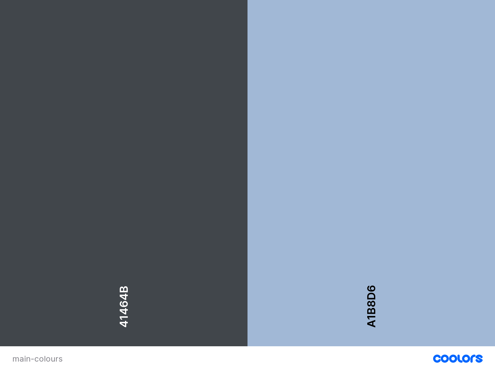
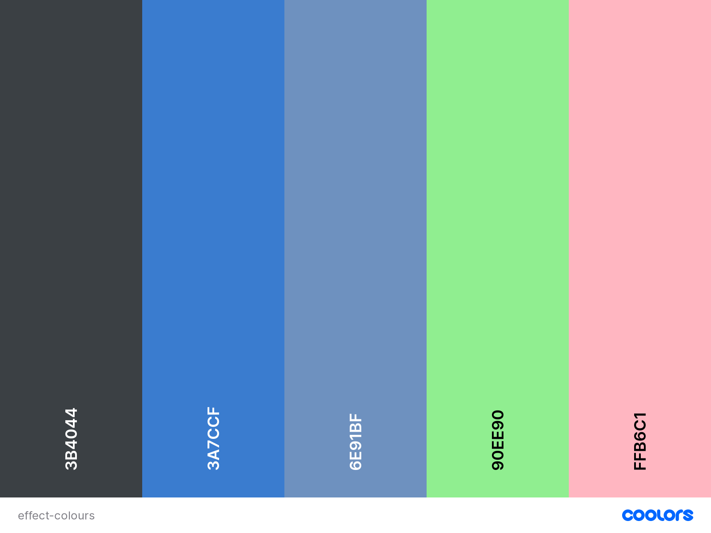

<h1 align="center">It sil heve</h1>

[View the live project here.](https://msierag.github.io/It-sil-heve/)

## Purpose of the website

This is a website for a simple quiz game about the Dutch Elfstedentocht, a long distance skating event on natural ice. Every time there is a prolonged period of frost, Dutch people anxiously await the decision whether this will be the year there will finally be another Elfstedentocht. The last event took place in early 1997. This year (2021) we came close, but due to the ongoing pandemic it was regretfully decided not to hold the race (which didn't stop individual citizens from skating the route on their own though). 
The purpose of this website is to provide the skating community with a quiz game as entertainment while they wait for the next Elfstedentocht. It is intended to bring the event to the attention of people outside the Dutch skating community. The name It sil heve was chosen because the words are synonymous with the Elfstedentoch anticipation. They are Frisian and mean "It will happen", they were used to announce the 1985 event and are also displayed on the Elfstedentoch monument. The website is designed to be responsive and accessible on a range of devices, making it easy to navigate for potential users.

## User Experience (UX)

-   ### User stories

    -   #### Visiting User Goals

        1. As a visiting user, I want to easily understand the main purpose of the site. 
        2. As a visiting user, I want to be able to easily navigate throughout the site.
        3. As a visiting user, I want to test my knowledge of the topic.
        4. As a visiting user, I want to know my position in the game.
        5. As a visiting user, I want to compete.
        
-   ### Design
    -   #### Colour Scheme
        -   There are eight colours used throughout the site, the first two are main colours and the remaining six are used for accents.
        ##### Main colours
                
            The colours #41464b and #a1b8d6 were chosen as they approach the palette of the background image on the index.html. The colours are cool to approach the colours seen in the landscape on a Dutch winter day, but with enough gray to not become too harsh when viewed on a screen.
        ##### Accent colours
               
               The colours #3b4044, #3accf, #6e91bf, #90ee90 and #ffb6c1 are accent colours. The first two are used in hover effects and box-shadows. #6e91bf is used on the game.html page to better set apart the answer-prefix. The last two colours are also used on the game.html to indicate whether the correct or incorrect answer has been selected. 
    -   #### Typography
        -   The Raleway font is the main font used throughout the whole website with Sans Serif as the fallback font in case the font isn't being imported into the site correctly. Raleway was chosen as it is an elegant sans-serif typeface family.
    -   #### Imagery
        -   The large background image on the index.html is representative of long-distance skating on natural ice in the Netherlands: large, open space with a few people. It provides a very serene scene, which was used as the guiding sense for the rest of the project. 

*   ### Wireframes

    -   Home page wireframe - [View](./assets/images/wireframes/itsilhevehome.png)

    -   Game page wireframe - [View](./assets/images/wireframes/itsilhevegame.png)

    -   End of game page wireframe - [View](./assets/images/wireframes/itsilheveendgame.png)

    -   Scoreboard page wireframe - [View](./assets/images/wireframes/itsilhevescoreboard.png)

    -   Mobile wireframes - [View](./assets/images/wireframes/itsilhevesmartphone.png)

    -   Tablet wireframes - [View](./assets/images/wireframes/itsilhevetablet.png)

## Features

### Existing features

#### Page specific features

##### Home page

-   Background image which conveys the atmosphere of skating on natural ice in the Netherlands. 

-   Name of the game and the topic are clearly visible. Text is intentionally kept to a minimum so as not to detract from the serene atmosphere of the background image.

-   Call to action button labelled How to Play which when clicked opens a modal with instructions to the game.

-   Call to action button labelled Let's Play which when clicked opens the game page. 

-   Call to action button labelled Scoreboard which when clicked opens the scoreboard page.  

##### Game page

-   Top left of the screen holds a section labelled Question which shows the number question the current question is out of the maximum of ten questions in every game.

-   Top right of the screen holds a section labelled Score which shows the number of points accumulated so far in the game.  

-   Middle section holds the question and a group of cards underneath which display the four possible answers to each question. The cards serve as buttons and have a hover effect. When selected the normally white background of the card changes colour to indicate whether the selection was correct or not.

-   Below the answers is a call to action button labelled Home which when clicked opens the home page.

##### End of game page

-   Background image which conveys the atmosphere of skating on natural ice in the Netherlands. 

-   Name of the game and the topic are clearly visible. Text is intentionally kept to a minimum so as not to detract from the serene atmosphere of the background image.

-   Call to action button labelled Save which is disabled until a character is typed into the input field for the name above it. Then, when clicked, the scoreboard page is opened now displaying the saved score.

-   Call to action button labelled Play again which when clicked opens the game page. 

-   Call to action button labelled Home at the bottom of the scoreboard which when clicked opens the home page.

##### Scoreboard page

-   Scoreboard is shown with the header scoreboard and a maximum of 5 scores to be displayed.

-   Call to action button labelled Home at the bottom of the scoreboard which when clicked opens the home page. 

### Future features

-   A Dutch version of the site so it will serve the Dutch general public as well. This was not done due to time constraints. 
-   A background information section which will give some instant information without having to search for it elsewhere online. 
-   More questions to create a greater variation in the quiz.

## Technologies Used

### Languages Used

-   [HTML5](https://en.wikipedia.org/wiki/HTML5)
-   [CSS3](https://en.wikipedia.org/wiki/Cascading_Style_Sheets)
-   [JavaScript](https://en.wikipedia.org/wiki/JavaScript)


### Frameworks, Libraries & Programs Used

1. [Bootstrap 5:](https://getbootstrap.com/docs/5.0/getting-started/introduction/)
    - Bootstrap was used to assist with the responsiveness and styling of the website.
1. [Google Fonts:](https://fonts.google.com/)
    - Google fonts was used to import the 'Raleway' font into the style.css file which is used throughout the project.
1. [Font Awesome:](https://fontawesome.com/)
    - Font Awesome was used to add the icons to the navigation and modal buttons used throughout the project.
1. [jQuery:](https://jquery.com/)
    - jQuery came with Bootstrap to make the navbar responsive but was also used for the smooth scroll function in JavaScript.
1. [Git](https://git-scm.com/)
    - Git was used for version control by utilizing the Gitpod terminal to commit to Git and Push to GitHub.
1. [GitHub:](https://github.com/)
    - GitHub is used to store the projects code after being pushed from Git.
1. [Balsamiq:](https://balsamiq.com/)
    - Balsamiq was used to create the wireframes during the design process.
1. [TinyJPG](https://tinyjpg.com/) 
    - TinyJPG was used to reduce image file sizes.
1. [Coolors](https://coolors.co/)
    - Coolors was used to generate the palette used throughout the site.

## Testing

### Validation 

The W3C Markup Validator and W3C CSS Validator Services were used to validate every page of the project to ensure there were no syntax errors in the project.

-   [W3C Markup Validator](https://jigsaw.w3.org/css-validator/#validate_by_input) 
    - Home - [Result](./assets/images/testing/validation/homehtml.png)
    - Game - [Result](./assets/images/testing/validation/gamehtml.png)
    - Endgame - [Result](./assets/images/testing/validation/endgamehtml.png)
    - Scoreboard - [Result](./assets/images/testing/validation/scoreboard.png)

    No errors or warnings were given for the HTML code.
    
-   [W3C CSS Validator](https://jigsaw.w3.org/css-validator/#validate_by_input) 

    No errors or warnings were given for the CSS code - [Results](./assets/images/testing/validation/css.JPG)

-       

### Google Lighthouse

I used Google Lighthouse to audit the site's performance, accessibility, use of best practices and search engine optimization.

Initial testing resulted in the following [score](./assets/images/testing/lighthouse/lighthouse.jpg):
-   Performance: 93%
-   Accessibility: 97%
-   Best Practices: 93%
-   SEO: 100%

**Performance** - Most of the suggested improvements involved removing or altering CSS and JavaScript elements which are included in Bootstrap. 
I decided against tampering with this. 

**Accessibility** - The contrast of the disclaimer in the footer in relation to the background was deemed to be low. Altering the colour would significantly change the overall look of the footer.
As the information is not essential to understanding the site, the existing colour was left in place.

**Best Practices** - The social media links in the footer were deemed to be unsafe. To improve this rel="noopener" was added to the links.

### Responsiveness testing

To test the responsiveness of the site [Chrome DevTools](https://developers.google.com/web/tools/chrome-devtools) and [Responsive Design Checker](https://responsivedesignchecker.com/) were used.

[Desktop 1920x1080](./assets/images/testing/responsiveness/desktop1920x1080.JPG)
[Notebook 1366x768](./assets/images/testing/responsiveness/notebook1366x768.JPG)
[Tablet 800x1280](./assets/images/testing/responsiveness/tablet800x1280.JPG)
[Tablet 768x1024](./assets/images/testing/responsiveness/tablet768x1024.JPG)
[Smartphone 414x736](./assets/images/testing/responsiveness/smartphone414x736.JPG)
[Smartphone 375x667](./assets/images/testing/responsiveness/smartphone375x667.JPG)

On screens below 360px the content of the cards becomes misaligned and text is lost from view. [Screensizemap](https://screensizemap.com/) was consulted to determine the popularity of this screen size.
The popularity listed for this type of screen hovers around 2% and seems to concern smartphones which can be considered at the end of their lifecycle. 
It is listed as a known issue.   

### Testing User Stories from User Experience (UX) Section

-   #### Visiting User Goals

    1. As a visiting user, I want to easily understand the main purpose of the site.

        1. Upon entering the site, users are automatically greeted with a clean and easily readable navigation bar to go to the page of their choice. [View](./assets/images/testing/userstories/navbar.png)
        2. Underneath there is a Hero Image with text stating the purpose of the site and a scrolling wheel to invite the user to scroll down. [View](./assets/images/testing/userstories/home.png)
        3. The user has two options, click the link to the page of their choice in the navigation bar or scroll down.
        4. Scrolling down leads the user to three sections each with a call to action button to lead the user to the respective Routes, Contact or Uploads pages. [View](./assets/images/testing/userstories/homecards.png)

    2. As a visiting user, I want to be able to easily navigate throughout the site to find content.

        1. The navigation bar with clearly marked links to the respective pages is the same across all pages. [View](./assets/images/testing/userstories/navbar.png)
        2. To return to the Home page, the user can either click on the link "Home" in the navigation bar or on the "Round the Bend" logo in the top left-hand area of the navigation bar.
        
    3. As a visiting user, I want to locate their social media links to see their following on social media to determine how trusted and known they are.
      
        1. The user can scroll to the bottom of any page on the site to locate the social media links in the right-hand section of the footer. [View](./assets/images/testing/userstories/footer.png)
        2. When clicked, the social media links will open up in a new tab to ensure the user can easily get back to the website. [View](./assets/images/testing/userstories/smopentabe.png)
               
    4. As a visiting user, I want to find the best way to get in contact with the organisation with any questions I may have.

        1. The user can reach the "Contact" page by either selecting the link in the navigation bar or the call to action button in the "Connect" section on the "Home" page. [View](./assets/images/testing/userstories/contacthome.png)
        2. On the "Contact" page the user can fill out the form on the page. [View](./assets/images/testing/userstories/contact.png)
        3. Alternatively, the footer contains links to the organisation's social media presence. [View](./assets/images/testing/userstories/socialmedia.png)
        4. When clicked, the social media links will open up in a new tab to ensure the user can easily get back to the website. [View](./assets/images/testing/userstories/smopentabe.png)

    5. As a visiting user, I want to be able to view the details of the routes.

        1. The user can reach the "Routes" page by either selecting the link in the navigation bar or the call to action button in the "Explore" section on the "Home" page.[View](./assets/images/testing/userstories/routeshome.png)
        2. The routes are listed on the "Routes" page by country of destination.[View](./assets/images/testing/userstories/routes.png)
        3. A short description of the route is provided with each route.
        4. Additional facts listed for each route are total length in km, starting location, final destination. 

    6. As a visiting user, I want to download the gps file for the route of my choice.
        
        1. The user can reach the "Routes" page by either selecting the link in the navigation bar or the call to action button in the "Explore" section on the "Home" page.[View](./assets/images/testing/userstories/routeshome.png)
        2. The routes are listed on the "Routes" page by country of destination. [View](./assets/images/testing/userstories/routes.png)
        3. Beneath the details and description of each individual route there is a button with the download symbol marked "GPX file", which is the file type used by SatNav's. [View](./assets/images/testing/userstories/dwnldbtn.png)
        4. When clicked, the download briefly opens in a new tab and closes as the download completes at the bottom of the screen. [View](./assets/images/testing/userstories/dwnldcomplete.png)
               
    7. As a visiting user, I want to be able to submit routes.
        
        1. The user can reach the "Uploads" page by selecting the link in the navigation bar or the call to action button in the "Inspire" section on the "Home" page. [View](./assets/images/testing/userstories/routeshome.png)
        2. Here the user is provided with a form to submit their own route.[View](./assets/images/testing/userstories/routes.png)  
        3. An easily distinguishable "Submit" button at the bottom of the form.  
           
    8. As a visiting user, I want to sign up to the Newsletter so that I am emailed any major updates and/or changes to the website or organisation.
        
        1. At the bottom of every page there is a footer which is the same throughout all pages.[View](./assets/images/testing/userstories/footer.png)
        2. In the middle of the footer the user sees a button marked "Subscribe to our Newsletter".[View](./assets/images/testing/userstories/nwsltrbtnselected.png)
        3. Upon clicking the button a modal form appears where the user is prompted to Enter their email address.[View](./assets/images/testing/userstories/newslettermodal.png)
        4. An easily distinguishable "Submit" button at the bottom of the modal form.  

### Known Issues

-   On mobile devices with a screen narrower than 360px the contents of the card section on index.html pushed out of alignment.
    -   Text and text on buttons disappears from view as a result.

## Deployment

### GitHub Pages

The project was deployed to GitHub Pages using the following steps:

1. Log in to GitHub and locate the [MS1_Round_the_Bend repository](https://github.com/)
2. At the top of the Repository (not top of page), locate the "Settings" Button on the menu.
    - Alternatively Click [Here](https://raw.githubusercontent.com/) for a GIF demonstrating the process starting from Step 2.
3. Scroll down the Settings page until you locate the "GitHub Pages" Section.
4. Under "Source", click the dropdown called "None" and select "Master Branch".
5. The page will automatically refresh.
6. Scroll back down through the page to locate the now published site [link](https://msierag.github.io/MS1_Round_the_Bend/) in the "GitHub Pages" section.

### Forking the GitHub Repository

By forking the GitHub Repository we make a copy of the original repository on our GitHub account to view and/or make changes without affecting the original repository by using the following steps...

1. Log in to GitHub and locate the [MS1_Round_the_Bend repository](https://github.com/)
2. At the top of the Repository (not top of page) just above the "Settings" Button on the menu, locate the "Fork" Button.
3. You should now have a copy of the original repository in your GitHub account.

### Making a Local Clone

1. Log in to GitHub and locate the [MS1_Round_the_Bend repository](https://github.com/)
2. Under the repository name, click "Clone or download".
3. To clone the repository using HTTPS, under "Clone with HTTPS", copy the link.
4. Open Git Bash
5. Change the current working directory to the location where you want the cloned directory to be made.
6. Type `git clone`, and then paste the URL you copied in Step 3.

```
$ git clone https://github.com/YOUR-USERNAME/YOUR-REPOSITORY
```

7. Press Enter. Your local clone will be created.

Click [Here](https://help.github.com/en/github/creating-cloning-and-archiving-repositories/cloning-a-repository#cloning-a-repository-to-github-desktop) to retrieve pictures for some of the buttons and more detailed explanations of the above process.

## Credits

### Code

-   [Bootstrap5](https://getbootstrap.com/docs/4.4/getting-started/introduction/): Bootstrap Library used throughout the project mainly to make site responsive using the Bootstrap Grid System.

### Content

-   All content was written by the developer.

-   Inspiration for this site came chiefly from [Motorroutes.net](https://motorroutes.net/) and [Rever](https://www.rever.co/)


### Media

-   Hero image was created by the developer.

-   Image for the "Explore" section on the "Home" page by Will Li on [Unsplash](https://unsplash.com/@willxli?utm_source=unsplash&utm_medium=referral&utm_content=creditCopyText)

### Acknowledgements

-   Friends and family for feedback and helpful suggestions.
